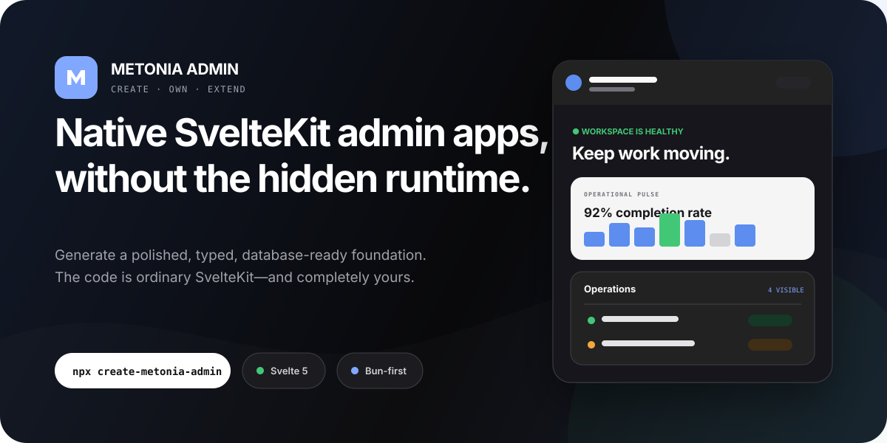

<p align="center">
  
</p>

<p align="center">
  <a href="https://www.npmjs.com/package/create-metonia-admin"></a>
  <a href="https://www.npmjs.com/package/create-metonia-admin"></a>
  <a href="./LICENSE"></a>
  
</p>

<p align="center">
  <strong>Generate a polished Svelte 5 + SvelteKit admin application in minutes.</strong><br />
  Native routes. Predictable boundaries. Real database code. No proprietary runtime.
</p>

## Start in one command

```bash
npx create-metonia-admin@latest
```

The interactive wizard asks only the questions that matter for your selected stack. It suggests `./<project-name>` in your current terminal directory, installs dependencies when requested, and can initialize Git for you.

Prefer another runner?

```bash
bunx create-metonia-admin@latest
npm create metonia-admin@latest
pnpm dlx create-metonia-admin@latest
yarn dlx create-metonia-admin@latest
```

> The `npm i create-metonia-admin` command shown on npm installs the package. Use one of the runner commands above to create a project.

## What you get

| Surface                  | Included                                                                                                             |
| ------------------------ | -------------------------------------------------------------------------------------------------------------------- |
| **Admin experience**     | Responsive shell, operational Dashboard, Settings, optional Users CRUD, loading/empty/error states, and a custom 404 |
| **UI**                   | Real shadcn-svelte primitives, seven Nova base colors, and Lucide, Tabler, HugeIcons, Phosphor, or Remix icons       |
| **Application boundary** | Native SvelteKit loads, form actions, thin routes, server-only repositories, and shared runtime-neutral contracts    |
| **Data stack**           | Zod, Drizzle ORM, generic PostgreSQL, `pg`, generated migration, and `.env.example`                                  |
| **Delivery**             | Adapter Node, optional Bun-tested Docker output, package-manager-owned commands, and configuration-aware docs        |
| **Ownership**            | Ordinary generated source code with no required Metonia runtime or hosted control plane                              |

The default Dashboard uses a generated shadcn-svelte Table through the canonical component alias. Page, view, and route ownership stays adapter-neutral so future verified UI adapters can replace primitives without forking the application architecture.

## A starter you can keep

Many admin starters make the first screenshot easy and every later change expensive. Metonia Admin optimizes for the codebase you own after generation:

- **Native SvelteKit** — no parallel router, REST layer, tRPC/GraphQL requirement, or client query framework.
- **Visible boundaries** — browser-safe UI cannot import database clients, secrets, or repositories.
- **Composable generation** — recipes add real variability without a Cartesian-product template matrix.
- **Honest capability status** — experimental and unavailable combinations fail before files are written.
- **Agent-friendly structure** — generated `AGENTS.md`, README, config, and nearby examples explain how the project is meant to grow.
- **Transactional output** — generation happens in private staging and publishes only after validation succeeds.

## Generated architecture

```text
src/lib/
├── client/
│   └── ui/
│       ├── components/   reusable UI primitives
│       ├── views/        meaningful screen sections
│       └── pages/        complete screen composition
├── server/               database, repositories, services, secrets
└── shared/               schemas, types, constants, pure utilities
```

```text
client -> shared <- server
pages  -> views  -> components
routes -> client pages
```

Routes own URLs, parameters, loads, actions, and data-boundary glue. They stay thin. Client code never imports `$lib/server`.

## Configure it explicitly

The same wizard configuration can be automated for CI, templates, or repeatable scaffolding:

```bash
npx create-metonia-admin@latest acme-admin \
  --package-manager bun \
  --ui shadcn-svelte \
  --theme zinc \
  --icon-library lucide \
  --data-pattern standard \
  --validation zod \
  --orm drizzle \
  --database postgresql \
  --provider generic \
  --driver pg \
  --no-docker \
  --users \
  --install \
  --no-git
```

Add `--json` for one versioned machine-readable result. Invalid combinations fail before a destination is written.

## Support status

Metonia Admin `0.1.x` is an early public release. The primary stack has substantial Windows x64 evidence, including fresh generation, installation, check, test, build, browser review, and real PostgreSQL behavior. Repeatable multi-OS release evidence is still in progress, so public capability labels remain intentionally conservative.

| Capability                   | Status                                                                                   |
| ---------------------------- | ---------------------------------------------------------------------------------------- |
| Bun, npm, pnpm, Yarn         | Experimental; full primary generated graph exercised on Windows x64                      |
| shadcn-svelte Nova           | Experimental; seven deterministic base-color snapshots, with Zinc fully reviewed         |
| Five shadcn-svelte icon sets | Experimental; every generated icon adapter passed install, check, test, and build        |
| Standard SvelteKit           | Experimental default; generated stack and PostgreSQL Users behavior verified             |
| Remote Functions             | Experimental query-boundary proof; Users intentionally unavailable                       |
| Docker                       | Experimental; Bun runtime verified, npm/pnpm/Yarn lock-aware plans structurally verified |
| Fluid UI and Deno            | Visible but unavailable until their complete integration contracts are verified          |

Authentication and authorization are deliberately deferred. Add access control before using a generated admin application in production. See the [verification ledger](./docs/verification.md) for exact evidence and limitations.

## Repository map

```text
apps/
├── reference-admin/   generated Standard reference application
├── playground/        generated Remote Functions proof
└── website/           product site and registry-driven configurator
packages/
├── cli/               published create-metonia-admin package
├── generator/         transactional recipes and source assets
└── registry/          typed capability catalog and compatibility rules
```

## Development

This monorepo is Bun-first and keeps one root `bun.lock`:

```bash
bun install
bun run check
bun run lint
bun run format:check
bun test
bun run build
```

Generated projects may choose Bun, npm, pnpm, or Yarn independently of the monorepo toolchain.

## Documentation

- [Product specification](./docs/product-spec.md)
- [Architecture decisions](./docs/adr/README.md)
- [QA strategy](./docs/qa-strategy.md)
- [Ecosystem research](./docs/research/ecosystem.md)
- [Executed verification](./docs/verification.md)
- [Engineering constitution](./AGENTS.md)

## Contributing

Issues and focused pull requests are welcome. Please read [CONTRIBUTING.md](./CONTRIBUTING.md) before changing generator contracts, generated fixtures, adapters, or release surfaces.

## License

[MIT](./LICENSE) © Metonia Admin contributors.
